# 5184838_Pavan_CM_

## 📚 Navigation
- [SDLC](#sdlc)
- [GIT](#git)
- [Linux](#linux)
- [C Programming](#c-programming)
- [Unit Testing](#Unit-Testing)

---

## SDLC
**Week 1 – Agile Certification**  
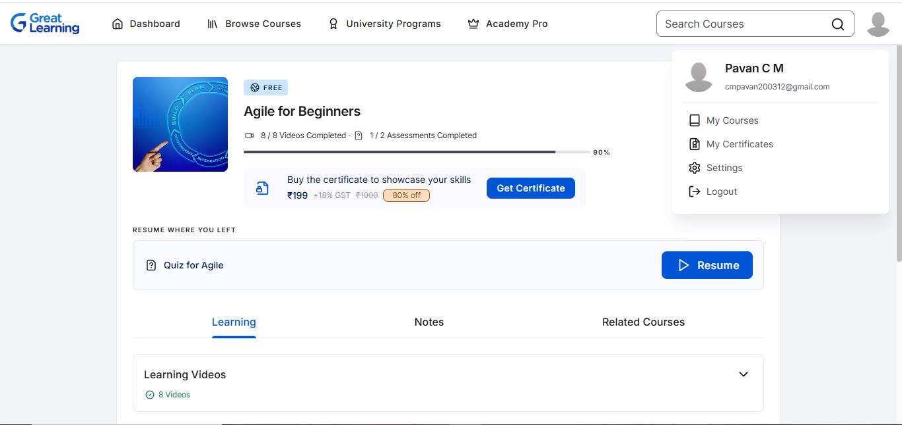

---

## GIT
**Week 2 – Git Certification**  

---

## Linux
**Week 3 – Linux History**  
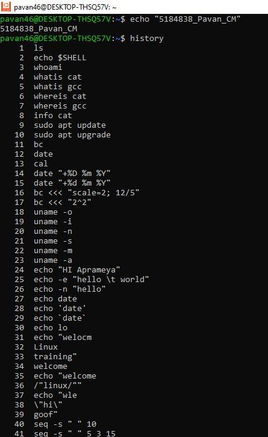  
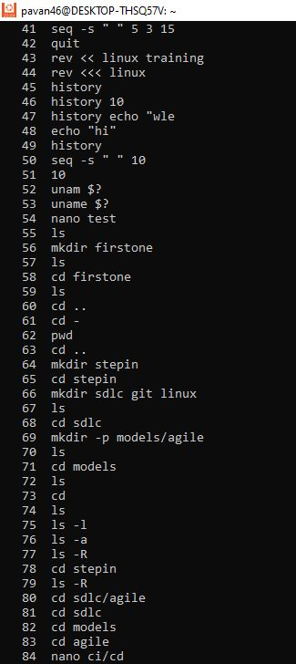  
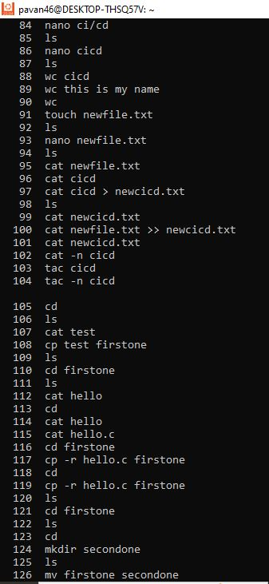  
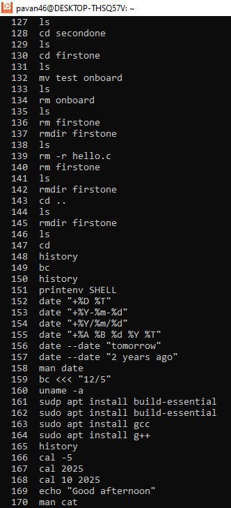  
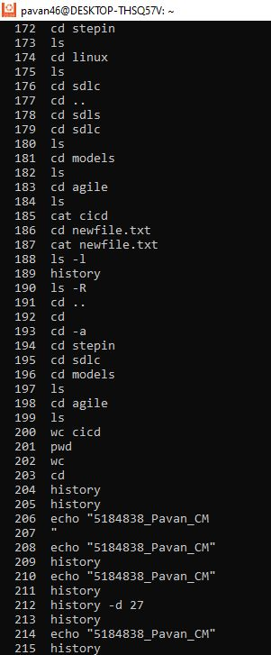  
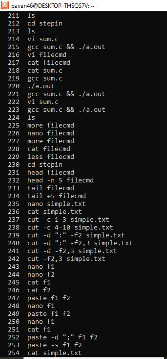  
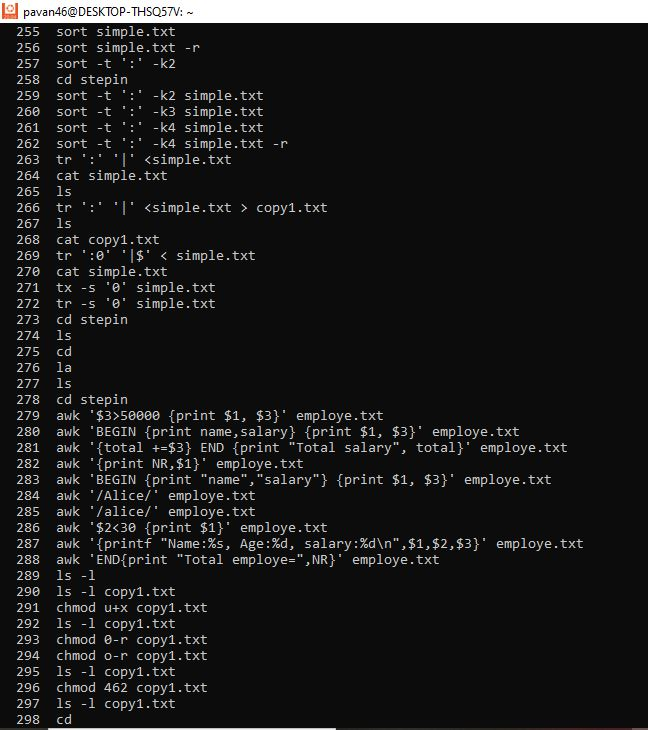  

---

## C Programming
**Week 4 – Introduction to C**  
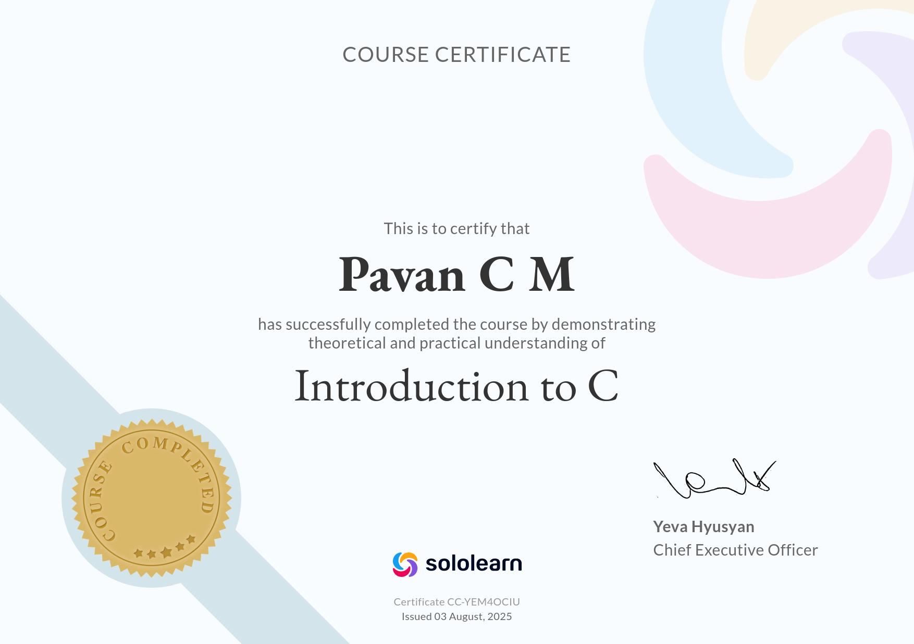    
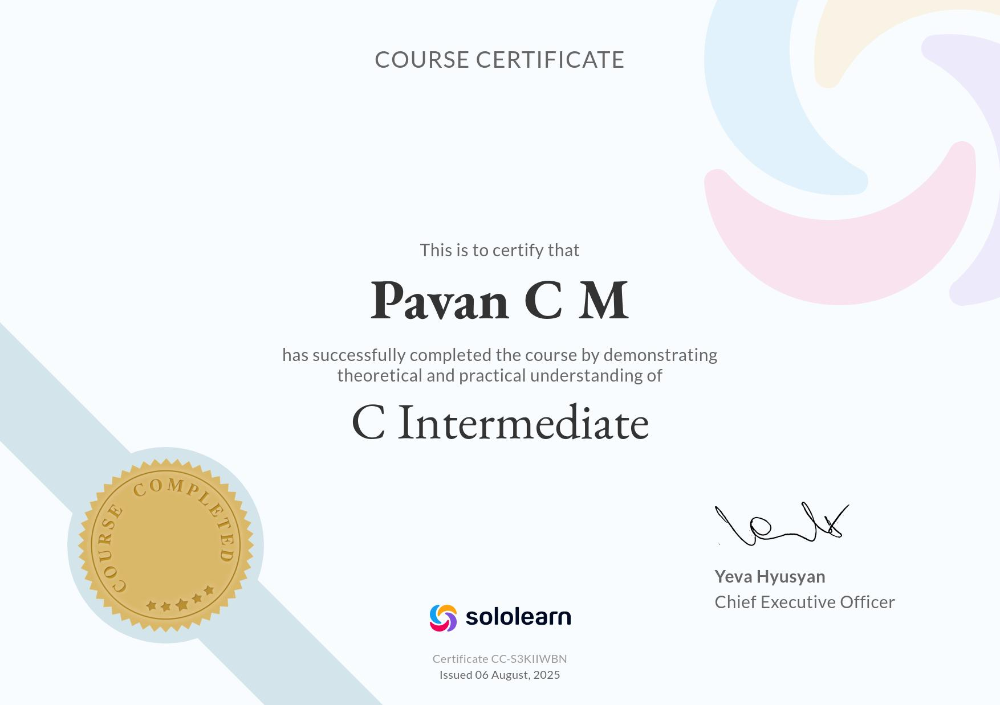

## Unit Testing
**Week 5 - Unit Testing Using Unity - Test case 1**
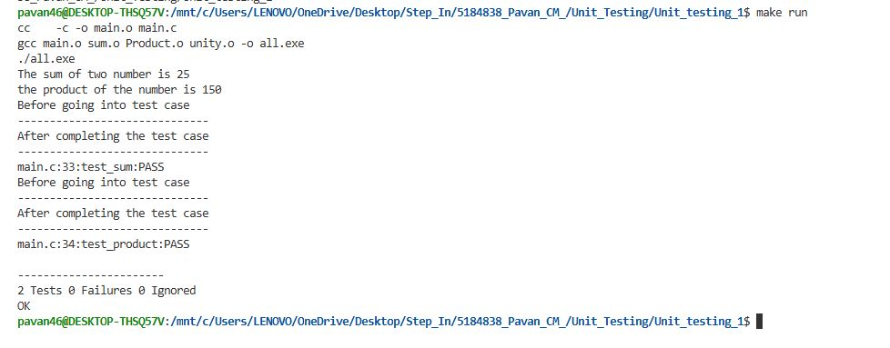
**Unit Testing Using Unity -Test case 2**
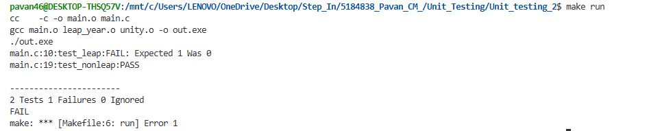
**Unit Testing Using Unity -Test case 3**
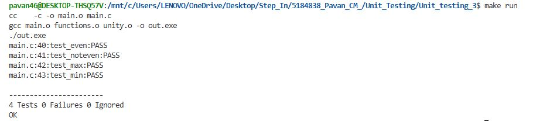
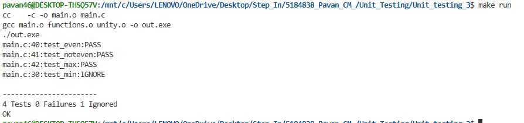
**Unit Testing Using Unity -Test case 4**
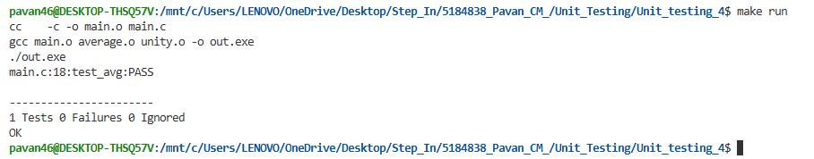

