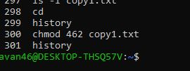

# 5184838_Pavan_CM_

## 📚 Navigation
- [SDLC](#sdlc)
- [GIT](#git)
- [Linux](#linux)
- [C Programming](#c-programming)

---

## SDLC
**Week 1 – Agile Certification**  

---

## GIT
**Week 2 – Git Certification**  

---

## Linux
**Week 3 – Linux History**  
  
  
  
  
  
  
  

---

## C Programming
**Week 4 – Introduction to C**  
    

